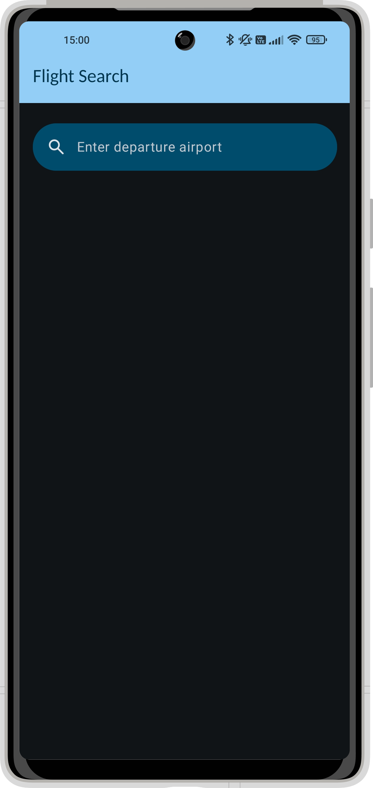
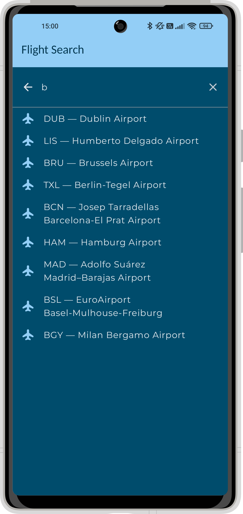
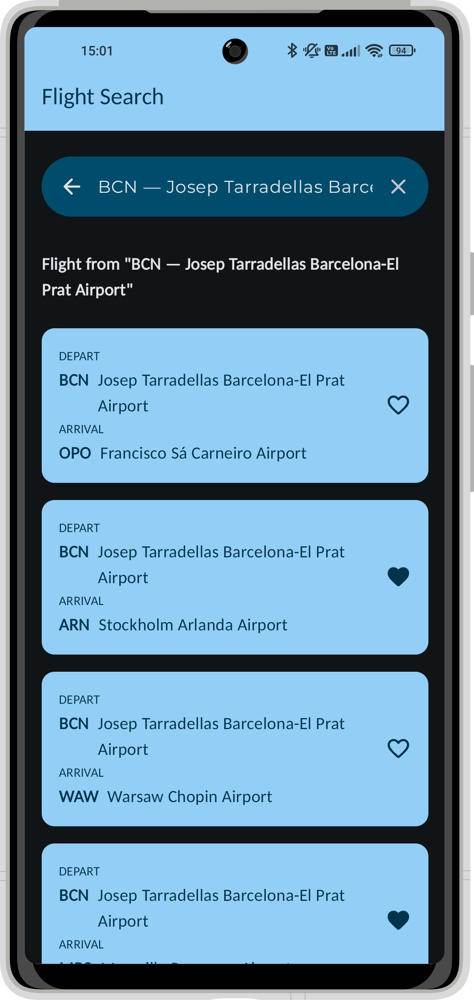
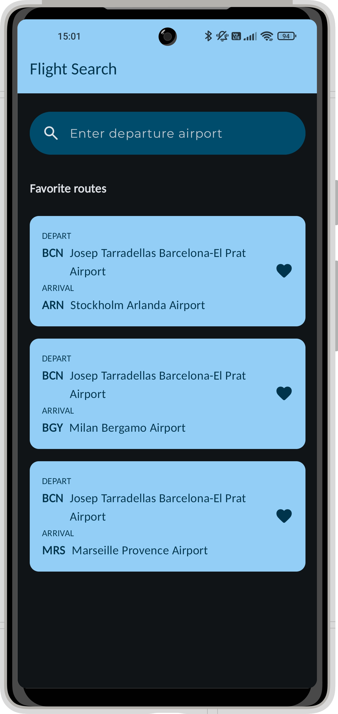
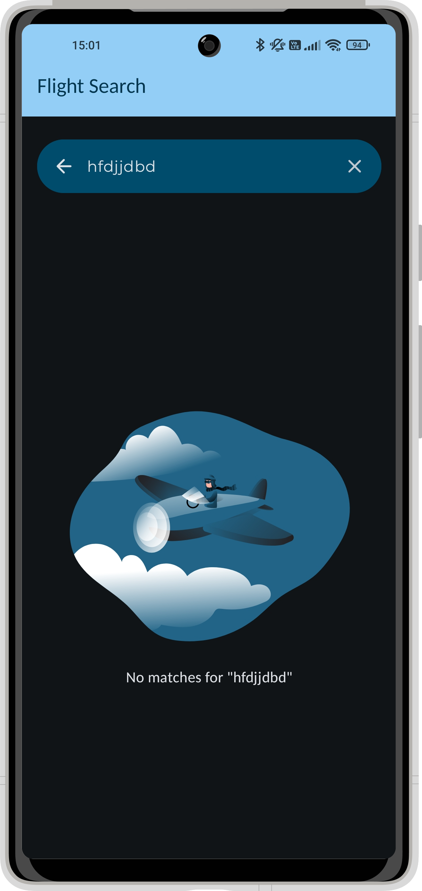

# ✈️ Flight Search

Android application developed with **Kotlin** and **Jetpack Compose**, focused on Clean Architecture, maintainability, and modern Android best practices.

## Overview
Flight Search is an Android application that allows users to search for flights from a departure airport using a local database and display the associated available destinations.

The primary objectives of this project are:

- Mastering **Jetpack Compose** fundamentals
- Work with local data persistence using **Room** and **DataStore**
- Apply a clear and scalable **MVVM architecture**, aligned with production standards
- Manage **UI state** and **navigation** in a modern Compose application
- Writing **clean, maintainable, and scalable** code

## Features
- **Intuitive Search**: Dynamic airport filtering by name or IATA code via a local database.
- **Favorites Persistence**: Robust bookmarking system for flight routes, persisted using Room.
- **State Management**: Implementation of Unidirectional Data Flow (UDF) via StateFlow, ensuring reactive UI updates and real-time filtering.
- **User Experience**: Persistence of the last user search via DataStore Preferences, allowing automatic state restoration when the app restarts.
- **Dark Mode Support**: Full support for light and dark themes using Material 3 theming.

## Technologies & Libraries
- Language: Kotlin
- UI: Jetpack Compose, Material 3
- Architecture: MVVM
- Presentation Layer: ViewModel, StateFlow / Flow
- Data Layer: Room (SQL), DataStore (Preferences)
- Asynchronicity: Coroutines

## Screenshots
| Home Screen | Search Screen | Flight Results | Favorites Flights | No matches search
|:---:|:---:|:---:|:---:|:---:|
|  |  |  |  |  |

